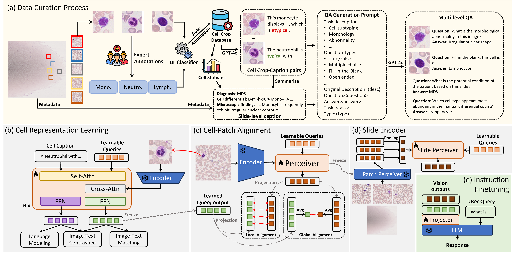

# PBSBench: A Multi-Level Vision-Language Framework and Benchmark for Hematopathology Whole Slide Image Interpretation

<div align="center">

[](https://arxiv.org/abs/2604.17570)
[](https://openaccess.thecvf.com/content/CVPR2026F/html/Wang_PBSBench_A_Multi-Level_Vision-Language_Framework_and_Benchmark_for_Hematopathology_Whole_CVPRF_2026_paper.html)
[](data/README.md)

[](LICENSE)
[](data/LICENSE)

</div>

This is the official code repository for **“PBSBench: A Multi-Level Vision-Language Framework and Benchmark for Hematopathology Whole Slide Image Interpretation,”** published at **CVPR Findings 2026**. It contains the core PBS-VL model, its four-stage training workflow, lightweight preprocessing utilities, and publication-ready PBSInstr/PBSBench question-answer annotations.

PBS-VL learns peripheral blood smear representations from cells upward: it aligns cell and patch representations, then aggregates patch representations for whole-slide question answering. This release is for research and education only; it is not a diagnostic device or clinical decision-support system.



## Repository structure

```text
.
├── configs/                  # Four paper-aligned training phases
├── data/
│   ├── PBSInstr/            # Training QA annotations
│   ├── PBSBench/            # ID/OOD benchmark QA annotations
│   ├── LICENSE              # CC BY 4.0 annotation license
│   └── README.md             # Schema, counts, and image acquisition
├── docs/                     # Data, preprocessing, and training guides
├── pbsbench/
│   ├── data/                 # Dataset readers and collators
│   ├── evaluation/           # PBSBench generation and paper metrics
│   ├── models/               # Core PBS-VL model components
│   ├── preprocessing/        # Tiling, QC, and cell crops
│   └── training/             # Training and inference entry points
├── pyproject.toml
├── requirements.txt
└── README.md
```

## Usage

### 1. Install

```bash
conda create --name pbsbench python=3.10 -y
conda activate pbsbench
conda install --channel conda-forge openslide openslide-python -y
pip install -r requirements.txt
```

The Conda packages install both the OpenSlide native library and its Python
bindings. `requirements.txt` then installs PBSBench and the
SentenceTransformers dependency used by the paper's semantic evaluation metric.
Optional Haemorasis QC and 4-bit Qwen dependencies are available separately:

```bash
pip install -e '.[preprocessing]'
pip install -e '.[qwen]'
```

Pretrained DinoBloom, BLIP-2/BERT, Qwen2.5-VL, Haemorasis QC, and Cellpose-SAM
assets are not stored here. Download the official DinoBloom-L checkpoint used
by PBS-VL from Hugging Face:

```bash
python -m pip install --upgrade huggingface_hub
hf download MarrLab/DinoBloom pytorch_model_l.bin --local-dir weights
```

The default configs expect `weights/pytorch_model_l.bin`. PBSBench obtains only
the matching ViT-L/14 architecture from the official DINOv2 Torch Hub
repository, with `pretrained=False`; DinoBloom supplies the weights. BLIP-2 and
BERT are downloaded from the retained LAVIS configuration, while Qwen accepts
either its public model ID or a local model directory.

### 2. Prepare data

Download and extract [S-BIAD440](https://www.ebi.ac.uk/biostudies/BioImages/studies/S-BIAD440), then materialize the images referenced by the in-domain annotations:

**Dataset release note.** The released QA counts differ slightly from those
reported in the paper because several annotation errors were corrected during
final data preparation, which shifted the distribution across the published
splits. See [data/README.md](data/README.md) for the complete released counts.

```bash
pbsbench-prepare-data \
  --annotations data/PBSInstr/cell_captions.jsonl \
                data/PBSInstr/cell_train.jsonl data/PBSInstr/cell_val.jsonl \
                data/PBSInstr/slide_train.jsonl data/PBSInstr/slide_val.jsonl \
                data/PBSBench/cell_id_test.jsonl data/PBSBench/slide_id_test.jsonl \
  --source S-BIAD440=/path/to/extracted/S-BIAD440 \
  --output data/images
```

> [!NOTE]
> The default configs expect `data/images`. If you use a different
> `--output`, override `data.image_root` during training or pass
> `--image-root` during cell evaluation.

Every QA record contains a dataset-native `source` locator. The command extracts each curated cell from its original WSI and writes the exact relative `image_path` consumed by the dataset loader. See [data/README.md](data/README.md) for the ID contract and OOD sources.

See [docs/PREPROCESSING.md](docs/PREPROCESSING.md).

### 3. Train PBS-VL

```bash
pbsbench-train --config configs/01_cell_representation.yaml
pbsbench-train --config configs/02_cell_patch_alignment.yaml
pbsbench-train --config configs/03_cell_qa.yaml

pbsbench-tile --slides data/images/slides/S-BIAD440 \
  --output data/processed/patches
pbsbench-extract-features \
  --config configs/02_cell_patch_alignment.yaml \
  --checkpoint checkpoints/cell_patch_alignment \
  --patches data/processed/patches \
  --output data/processed/patch_features

pbsbench-train --config configs/04_slide_qa.yaml
```

See [docs/TRAINING.md](docs/TRAINING.md) for checkpoint handoffs.

### 4. Run inference

```bash
pbsbench-infer --config configs/04_slide_qa.yaml \
  --checkpoint checkpoints/slide_qa \
  --input data/processed/example_slide_features.pt \
  --question "What morphological abnormalities are present?"
```

### 5. Evaluate on PBSBench

Cell track:

```bash
pbsbench-evaluate \
  --config configs/03_cell_qa.yaml \
  --checkpoint checkpoints/cell_qa \
  --annotations data/PBSBench/cell_id_test.jsonl \
  --image-root data/images \
  --output predictions/cell_id.jsonl \
  --semantic-model sentence-transformers/all-MiniLM-L6-v2
```

Slide track:

```bash
pbsbench-evaluate \
  --config configs/04_slide_qa.yaml \
  --checkpoint checkpoints/slide_qa \
  --annotations data/PBSBench/slide_id_test.jsonl \
  --feature-root data/processed/patch_features \
  --output predictions/slide_id.jsonl \
  --semantic-model sentence-transformers/all-MiniLM-L6-v2
```

The evaluator writes one JSONL prediction per question and a neighboring
`.metrics.json` file with true/false accuracy, multiple-choice accuracy,
fill-in-the-blank exact/partial match, and open-answer BLEU-1, ROUGE-L, and
optional semantic cosine similarity.

## Citation

CVPR Page: [CVPR](https://openaccess.thecvf.com/content/CVPR2026F/html/Wang_PBSBench_A_Multi-Level_Vision-Language_Framework_and_Benchmark_for_Hematopathology_Whole_CVPRF_2026_paper.html)

```bibtex
@InProceedings{wang2026pbsbench,
    author    = {Wang, Yuanlong and Chen, Weichi and Rajab, Adrian and Liu, Wenfang and Jin, Yulan and Srisuwananukorn, Andrew and Zhang, Ping},
    title     = {PBSBench: A Multi-Level Vision-Language Framework and Benchmark for Hematopathology Whole Slide Image Interpretation},
    booktitle = {Proceedings of the IEEE/CVF Conference on Computer Vision and Pattern Recognition (CVPR) Findings},
    month     = {June},
    year      = {2026},
    pages     = {5569-5578}
}
```

## License

The software is released under the [BSD 3-Clause License](LICENSE). The curated
PBSInstr and PBSBench question-answer annotations and associated metadata are
released separately under [CC BY 4.0](data/LICENSE). These licenses do not
relicense source microscopy images or other third-party assets; see
[THIRD_PARTY.md](THIRD_PARTY.md).
